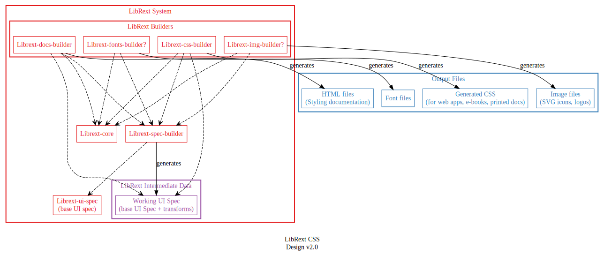

# LibRext Design (Overview)

Design documentation for GSI's UI design system and component library.

&nbsp;

## System Design

LibRext will be implemented as a front-end focused monorepo (HTML, CSS, JS, etc.)

More about [System Design](./system-design.md)

&nbsp;

## Aesthetic Principles

LibRext is inspired primarily by printed texts during the [era of the Incunabula](https://en.wikipedia.org/wiki/Incunable), the [first century after Gutenberg's press](https://www.britannica.com/topic/incunabula) changed Europe and the world. This was a time when old manuscript production methods were giving way to the next phase of bookmaking. New processes were explored, but printmakers were not far from the era of scribes writing huge manuscripts.

**BELOW**: Valerius Maximus. Mainz: Peter Schöffer, 18. kal. Jul. 1471

More about [Aesthetic Principles](./aesthetic-principles.md)

&nbsp;

## GSI Style Guide v2.0

Some partially-complete work I did back in September. Still using a lot of _Lorem ipsum_ to fill out areas, but there are solid ideas in here.

### Typography Specimens

More about [GSI Style Guide v2.0](./gsi-style-guide.md)

&nbsp;
