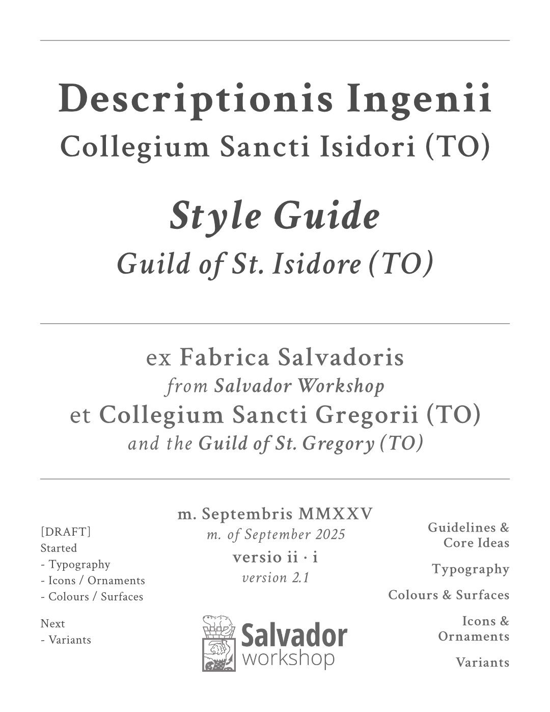

# LibRext Design (Overview)

Design documentation for GSI's UI design system and component library.

## System Design

LibRext will be implemented as a front-end focused monorepo (HTML, CSS, JS, etc.) Major sections of the design system / library include:

- Style Guides
- Assets and Icon Sets
- Stylesheet Library
- CSS Module Library
- React Component Library

More about [System Design](./system-design.md)

## Aesthetic Principles

LibRext is inspired primarily by printed texts during the [era of the Incunabula](https://en.wikipedia.org/wiki/Incunable), the [first century after Gutenberg's press](https://www.britannica.com/topic/incunabula) changed Europe and the world. This was a time when the old manuscript production methods were giving way to the next phase of bookmaking. New processes were being explored, but these printmakers still weren't far from the era of scribes writing huge volumes by hand.

**BELOW**: Valerius Maximus. Mainz: Peter Schöffer, 18. kal. Jul. 1471

More about [Aesthetic Principles](./aesthetic-principles.md)

## Markdown Elements

LibRext designs around core HTML elements rendered by Markdown processors, such as:

### Headings

| Element | Markdown | HTML | LibRext |
| --- | --- | --- | --- |
| ... | `#` to `######` | `<h1>` to `<h6>` | `<Heading level="h1">` |

### Body Text

| Element | Markdown | HTML | LibRext |
| --- | --- | --- | --- |
| ... | `content` | `
` | `<Paragraph>` |
| ... | `**content**` | `<strong>` | `<Text style="bold">` |
| ... | `_content_` | `<em>` | `<Text style="italic">` |
| ... | \`content\` | `<code>` | `<Text style="monospace">` |

More about [Markdown Elements](./markdown-elements.md)

## Scripture Elements

The system also seeks to model typographic and design elements of biblical and liturgical books. Things like:

| Element | LibRext | HTML 
| --- | --- | --- |
| Book/Chapter/Verse markings | `<BookHeading location="wis-9-6">`, `<BookLocator type="chapter" location="wis-9-6">` | ... |
| Footnotes, references to other parts of text | `<BookFootnote location="wis-9-6">` |   ... |
| Typographic flair (ligatures, ornamentations) | `<Ornament type="corner" variant="modern" direction="top-left">` | ... |
| ornate capitals, Illuminations | `<IlluminatedText style="">` |   ... |
| Music scores | `<MusicScore ... >` |   ... |

More about [Scripture Elements](./scripture-elements.md)

## GSI Style Guide v2.0

More about [GSI Style Guide v2.0](./gsi-style-guide.md)
