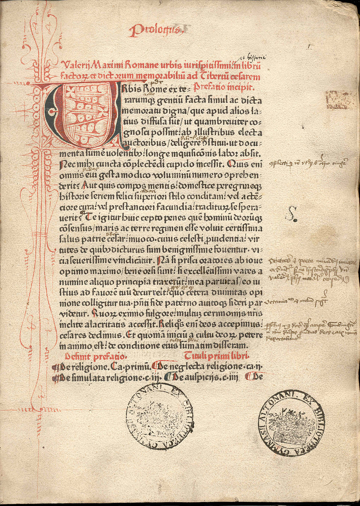

# AESTHETIC PRINCIPLES

Back to [main README](../../README.md)  
Back to [LibRext Design (Overview)](../design/README.md)

---

## INSPIRATION

Printed texts during the [era of the Incunabula](https://en.wikipedia.org/wiki/Incunable), the [first century after Gutenberg's press](https://www.britannica.com/topic/incunabula) changed Europe and the world. This was a time when the old manuscript production methods were giving way to the next phase of bookmaking. New processes were being explored, but these printmakers still weren't far from the era of scribes writing huge volumes by hand.

**ABOVE**: Valerius Maximus. Mainz: Peter Schöffer, 18. kal. Jul. 1471  
**BELOW**: Samuel Marochitanus ; Pseudo Poncio Pilato - Epistola ad Tiberium (1480-1484)

")

LibRext has a particular focus on biblical and liturgical texts, and all their fine details.

## USE CASES

LibRext aims to look consistent on ***Print, E-Reader, and Screen***.

### Print

- has bounds

### Screen

- ever-shifting
- interactive
- animations
- tactile feedback

### E-Reader

- something of a blend between the two
- older E-Readers have a long update time and small screens
- more advanced (expensive) ones are bigger, with a quicker refresh rate

")

**ABOVE**: Alonso de Cartagena, Doctrinal de los caballeros (1487)  
**BELOW**: Guy de Chauliac, Chirurgia magna (1498)

## RESOURCES

| Resource | Description | Link
|---|---|---|
| ISTC | ... | https://data.cerl.org/istc/_search |
| UChicago Library | ... | https://guides.lib.uchicago.edu/c.php?g=527774&p=3608589 |
| Thomas Fisher Rare Book Library | ... | https://fisher.library.utoronto.ca/collections/incunabula |

")

**ABOVE**: Portret van Justus Lipsius, humanist en hoogleraar te Leiden en Leuven (1500)  
**BELOW**: Aldus Manutius, Vergilius (1501)  

")
