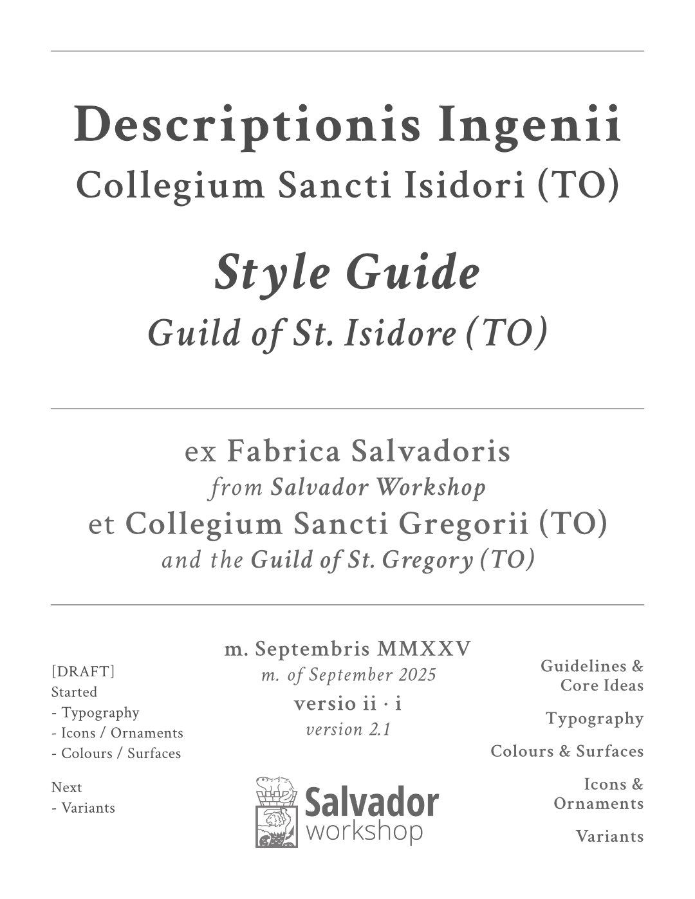
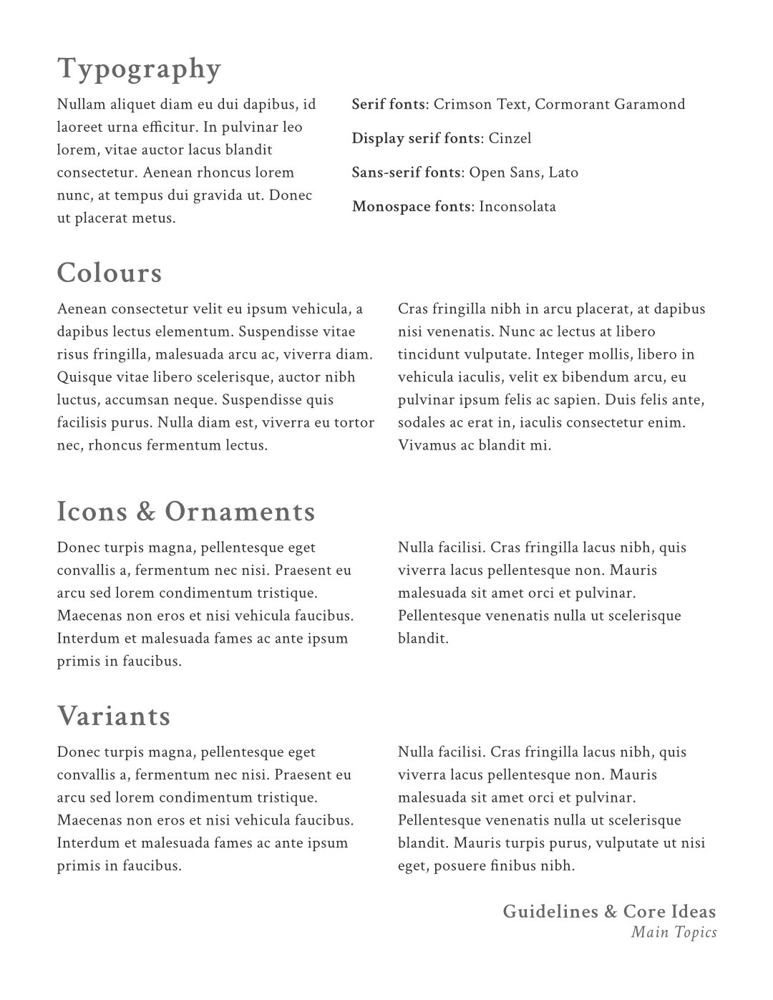
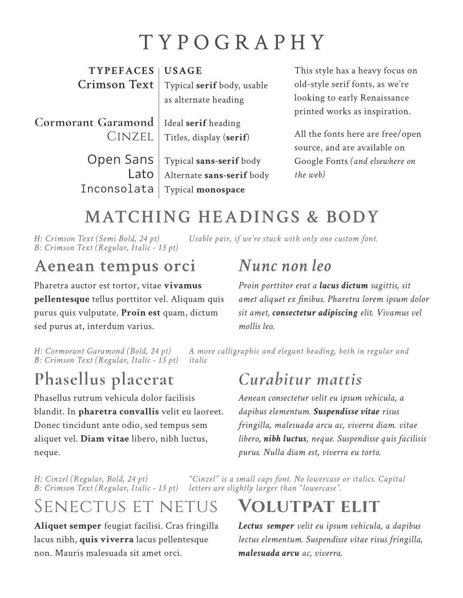
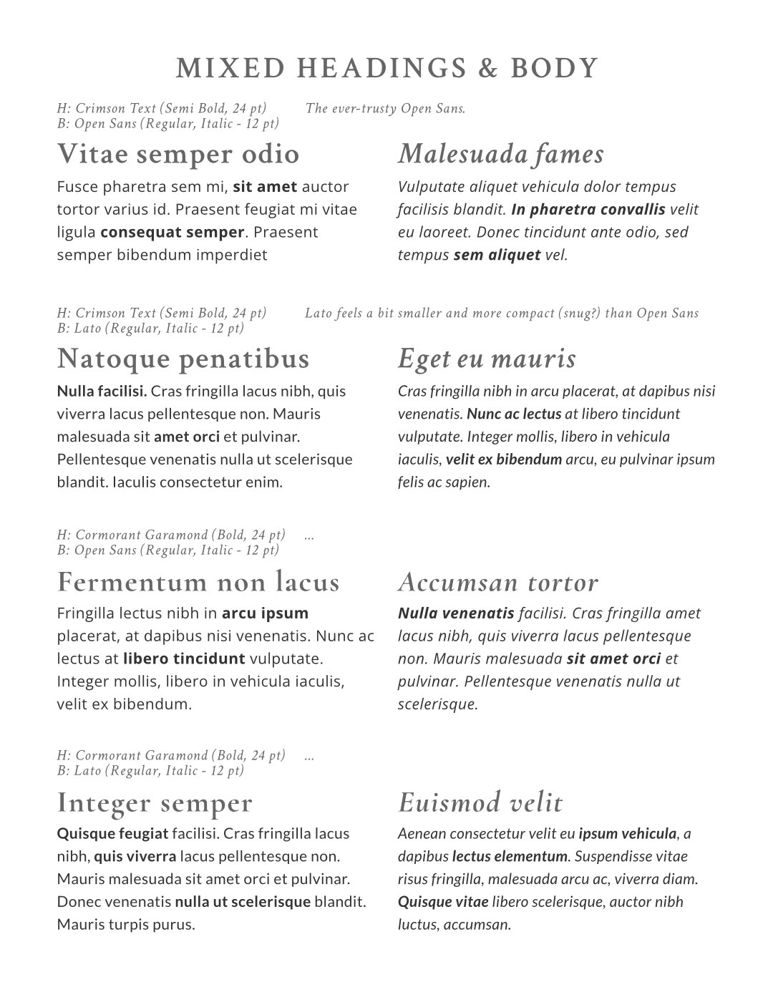
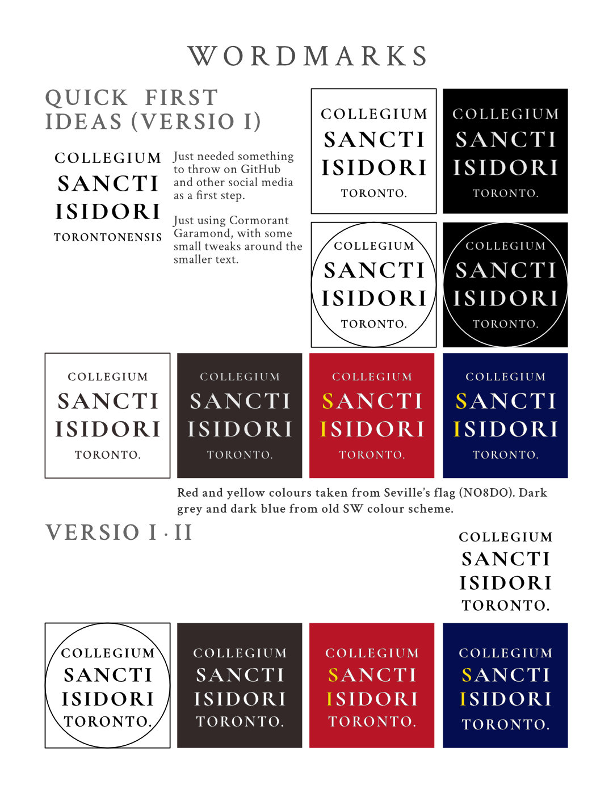
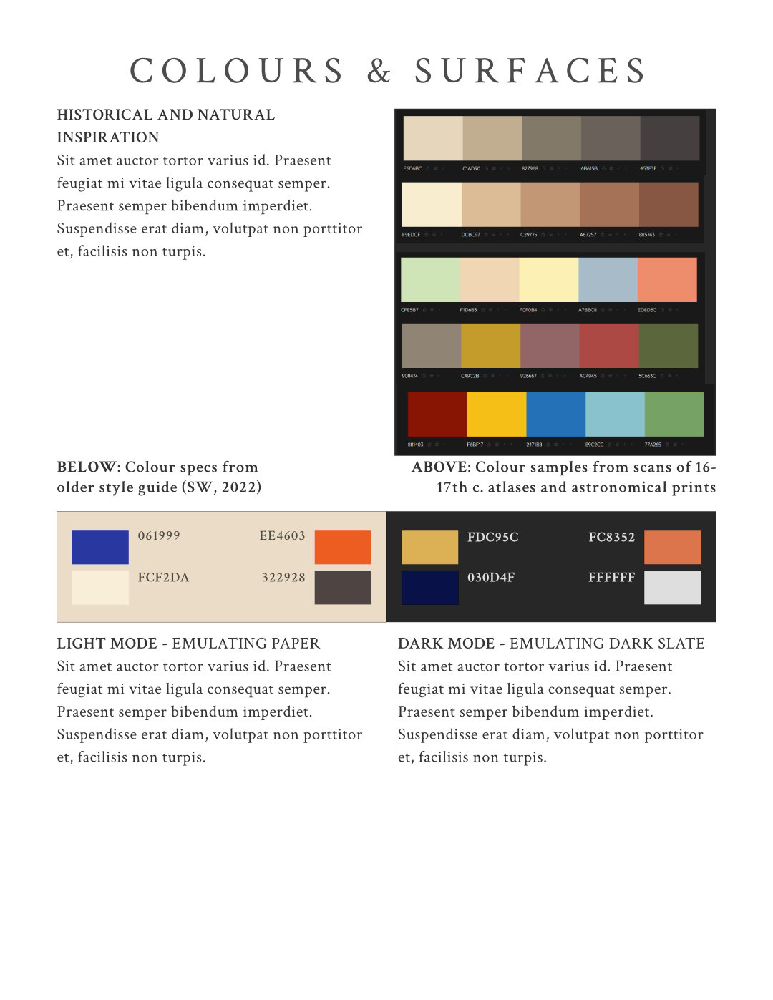
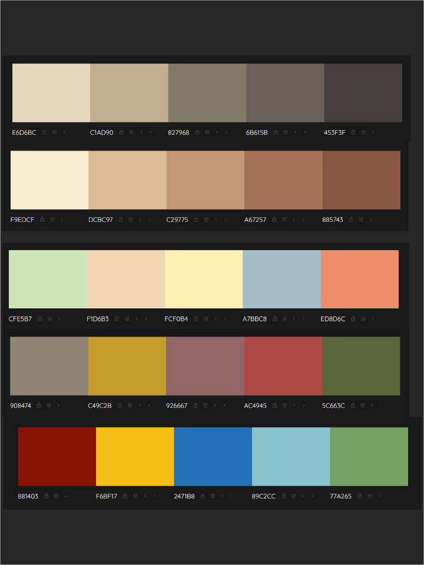
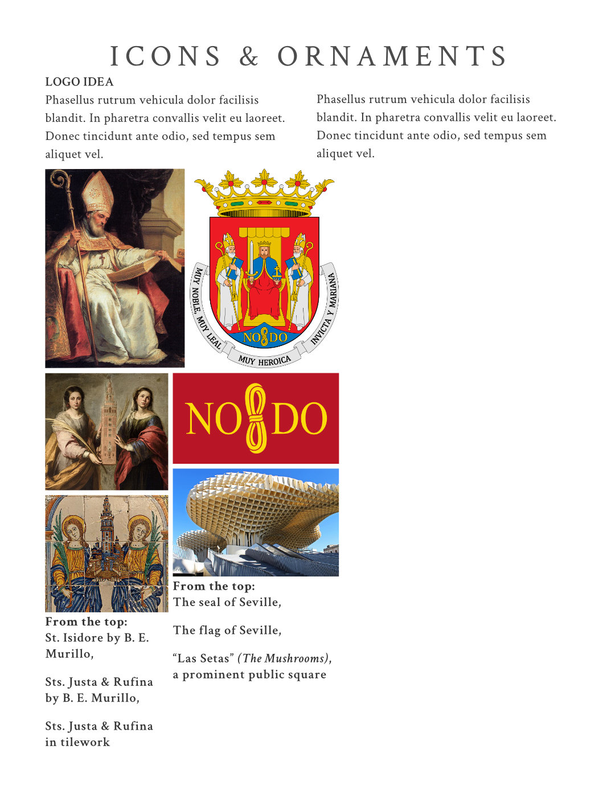

# GSI Style Guide v2.1 (Sep 2025)

Back to [main README](../../README.md)  
Back to [LibRext Design (Overview)](../design/README.md)

---

Some partially-complete work I did back in September. Still using a lot of _Lorem ipsum_ to fill out areas, but there are solid ideas in here.

## Title, Preface

Very wordy, but gets the idea across

## Typography

Ideas

### Specimens

### Wordmarks

## Colours

### Old school palette

Colour samples from scans of 16-17th c. atlases and astronomical prints

## Inspiration

