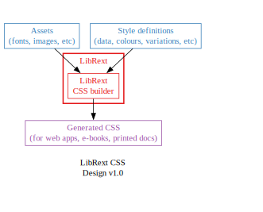

# SYSTEM DESIGN

Back to [main README](../../README.md)  
Back to [LibRext Design (Overview)](../design/README.md)

---

## OVERVIEW

- implement as monorepo
- one for each major section or version of the library
    + React
    + Web Components
    + Icon Sets
    + CSS Variables
- Build around core Markdown element set

## MONOREPO STRUCTURE

...

### Resources, Guides

- [Sample monorepo setup](https://github.com/wixplosives/sample-monorepo) with npm workspaces and typescript project references.
- [Exploring the Monorepo #2: Workspaces (npm, pnpm)](https://dev.to/jonlauridsen/attempt-2-workspaces-npm-pnpm-336a)
- [Monorepo setup with Npm Workspaces & Lerna](https://vedanshmehra.hashnode.dev/monorepo-setup-with-npm-workspaces-lerna)
- [Using `npm` Workspaces for Monorepo Management](https://earthly.dev/blog/npm-workspaces-monorepo/)
- [A Comprehensive Guide to npm Workspaces and Monorepos](https://leticia-mirelly.medium.com/a-comprehensive-guide-to-npm-workspaces-and-monorepos-ce0cdfe1c625)
- [Setting up a monorepo using npm workspaces and TypeScript Project References](https://medium.com/@cecylia.borek/setting-up-a-monorepo-using-npm-workspaces-and-typescript-project-references-307841e0ba4a)

## PACKAGES

### `librext-styleguides/` - Style Guides

- Fairly static content
- Figma examples
- Style Guide in PNG, SVG

### `librext-assets/` - Assets and Icon Sets

- `librext-assets/svg/` SVG
- `librext-assets/img/` JPG/PNG/WEBP
- `librext-assets/fonts/` Fonts
- `librext-assets/models/2d/` 2D models
- `librext-assets/models/3d/` 3D models

### `librext-css/` - Stylesheet Library

LibRext design system's vanilla CSS stylesheets.

- Generated by Node.js scripts and front-end tools
- main export: vanilla CSS stylesheets
- secondary export: files that fit around the styles (images, fonts, models)

### `librext-cssmodules/` - CSS Module Library

LibRext design system's CSS Modules.

- Something like this example:  
https://dev.to/evanwinter/create-your-own-css-utility-library-582d
- main export: CSS modules

### `librext-react/` - React Component Library

React component library using Base-UI and LibRext design system.

- Builds around the core [Markdown Elements](./markdown-elements.md) set
- main export: React components

#### Base-UI

https://base-ui.com/react/overview/quick-start  

Unstyled UI components for building accessible web apps and design systems. From the creators of Radix, Floating UI, and Material UI.
